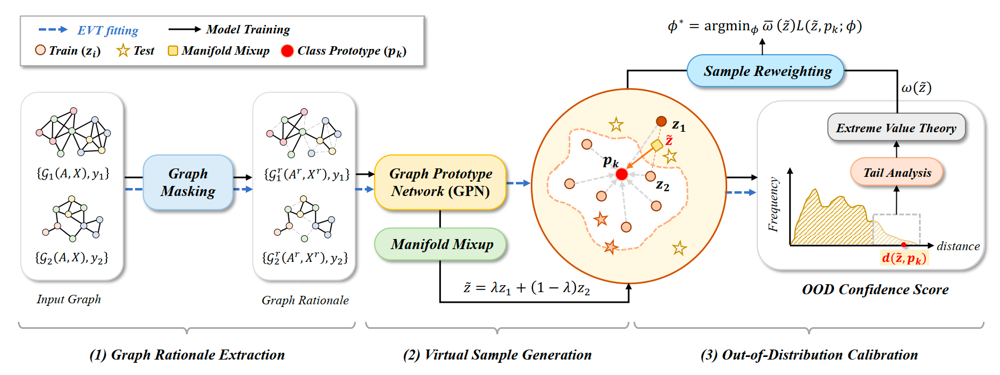

# OOD-GMixup
Graph Out-of-Distribution Generalization with Controllable Data Augmentation

## Requirements
* `numpy==1.21.3`
* `torch==1.8.1`
* `torch-cluster==1.5.9`
* `torch-geometric==2.0.2`
* `torch-scatter==2.0.8`
* `torch-sparse==0.6.11`
* `libmr==0.1.9`

The installation of libMR, please refer to this link: https://github.com/abhijitbendale/OSDN

## Datasets
All the datasets are provided by [pytorch_geometric](https://pytorch-geometric.readthedocs.io/en/latest/modules/datasets.html). 

## Run the codes
Train and evaluate the model:
* `python main.py --dataset <dataset_name> --backbone <backbone> --pooling <pooling>`  
